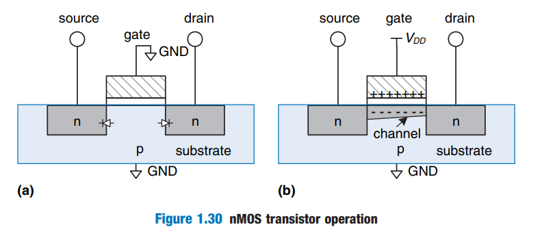

# Chapter 1: CMOS Transistors

- MOSFET stands for metal-oxide-smiconductor field effect transistors, MOS transistors
- Silicon doped with Boron have a free hole. It is a p-type, anode.
- Silicon doped with Arsenic have a free electron. It is a n-type, cathode.
- p-n junction forces current to be -> direction.
- $C = \cfrac{Q}{V}$
-   
- nMOS pass 0 well, while pMOS pass 1 well
- CMOS stands for Complementary MOS
- rule of conduction complements: to ensure that all output is pulled high or low and not shorted or floating:
    - When nMOS transistors are in series, the pMOS transistors must be in parallel.
    - When nMOS transistors are in parallel, the pMOS transistors must be in series.

# Chapter 2: Combinational Logic Design

- Circuit black box:
    - discrete-valued input and output terminals
    - functional specification (relationship between input and output)
    - timing specification (lower nad upper bounds of delay between inputs changing and outputs responding)
- bus - a bundle of multiple signals
- A circuit is combinational if it consists of interconnected circuit elements that:
    - Every circuit element is itself combinational
    - every node of the circuit is either designated as an input to the circuit or connects to exactly one output terminal of circuit element
    - Circuit contains no cyclic paths: every path through the circuit vists each circuit node at most once